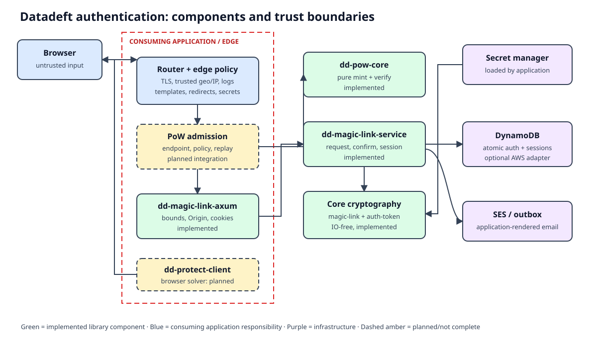
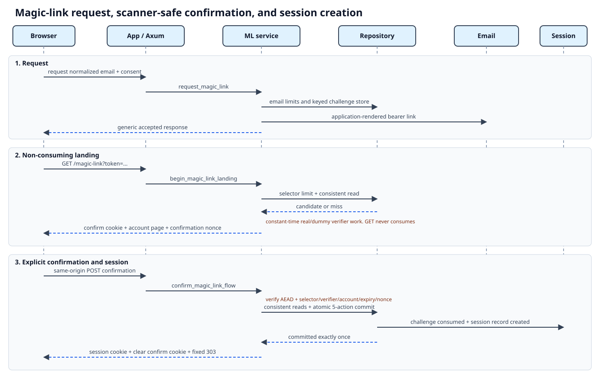
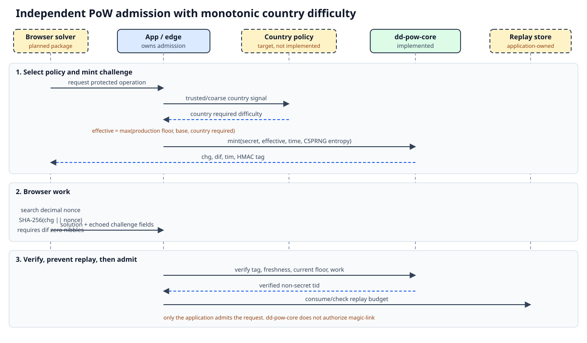

# Architecture

**Status:** This document describes the current repository.

The repository provides reusable authentication libraries. The consuming application owns routes, deployment policy, secrets, email templates, logs, and proof-of-work admission.



## Components

| Component | Responsibility | Status |
| --- | --- | --- |
| `datadeft-pow-core` | Mint and verify PoW challenges. | Ready |
| `datadeft-auth-token-core` | Encrypt cookies and manage purpose keys. | Ready |
| `datadeft-magic-link-core` | Parse tokens and compute HMAC lookup values. | Ready |
| `datadeft-magic-link-service` | Run request, confirmation, session, and repository logic. | Ready |
| `datadeft-magic-link-axum` | Parse HTTP input and create safe responses. | Ready |
| `datadeft-magic-link-aws` | Store data in DynamoDB and send email with SES. | Ready for test deployment |
| Consuming application | Configure routes, secrets, templates, logs, and edge policy. | Required |
| `dd-protect-client` | Solve PoW in the browser. | Ready |
| Example app | Show a full fake-backed Axum flow. | Available |

The dependency direction stays one-way.

```text
datadeft-auth-token-core      -> no workspace crates
datadeft-magic-link-core     -> datadeft-auth-token-core
datadeft-magic-link-service  -> datadeft-magic-link-core, datadeft-auth-token-core
datadeft-magic-link-axum     -> datadeft-magic-link-service
datadeft-magic-link-aws      -> datadeft-magic-link-service

consuming application  -> selected adapters and services
PoW admission          -> datadeft-pow-core
```

## Magic-link flow



1. The request service validates consent and the normalized email.
2. The request service applies keyed-email limits.
3. The request service creates an independent selector and verifier.
4. The repository stores only keyed material.
5. The outbox sends the bearer link.
6. The `GET` landing route parses the token.
7. The landing route applies a keyed-selector limit.
8. The landing route reads repository state.
9. The landing route compares verifier material in constant time.
10. The landing route does dummy work on a miss.
11. The landing route mints a five-minute confirm cookie.
12. The confirm cookie binds selector, verifier proof, account, expiry, and nonce.
13. The `GET` landing route never consumes the challenge.
14. The page shows the account and asks for a same-origin `POST`.
15. The `POST` route validates the flow state.
16. The repository commits challenge consumption and session creation atomically.
17. The browser gets a session cookie and a fixed `303` redirect.
18. Session validation checks the cookie and server state.
19. Logout revokes server state before it clears the cookie.

## PoW flow



`datadeft-pow-core` is deterministic. It does not read clocks, files, network, or environment variables.

It can do these tasks:

1. Mint a challenge from a server secret, difficulty, time, and entropy.
2. Authenticate challenge metadata with HMAC-SHA-256.
3. Verify freshness, minimum difficulty, and SHA-256 work.
4. Return a stable replay identifier.

The consuming application owns country-aware PoW policy. Country policy can only increase work.

```text
effective_difficulty = max(
    production_floor,
    configured_base_difficulty,
    country_required_difficulty
)
```

The repository does not yet include these PoW parts:

- country-to-difficulty policy
- upstream PoW middleware
- replay lifecycle
- end-to-end PoW integration

PoW stays independent from magic-link. Magic-link does not carry a PoW result, IP address, or client key.

## Trust boundaries

| Boundary | Untrusted input | Required control |
| --- | --- | --- |
| Browser to app | Email, token, cookies, body, headers, PoW solution | Bounds, parse rules, generic errors, TLS |
| Edge to origin | Request target, IP, country headers | Trusted overwrite rules and token-safe logs |
| App to libraries | Clock, CSPRNG, keyrings, redirects, templates, policy | Purpose separation and validated config |
| Service to storage | Repository and delivery results | Typed errors and atomic repository contract |
| AWS provider | DynamoDB and SES behavior | IAM, encryption, TTL, tests, and strong reads |
| Email channel | Bearer magic-link token | Short TTL and scanner-safe confirmation |

## Security mechanisms

| Purpose | Mechanism |
| --- | --- |
| Session and confirm cookies | XChaCha20-Poly1305 |
| Key derivation | HKDF-SHA-256 with purpose and key ID |
| Magic-link lookup | HMAC-SHA-256 |
| Magic-link entropy | 128-bit selector and 256-bit verifier |
| Flow state | AEAD body plus confirmation nonce |
| PoW challenge identity | BLAKE3 over time and entropy |
| PoW challenge tag | HMAC-SHA-256 |
| PoW work | SHA-256 with leading zero hex characters |
| PoW replay identity | BLAKE3 challenge digest |
| Constant-time checks | `subtle::ConstantTimeEq` |
| One-time auth | DynamoDB transaction or matching repository action |
| Session revocation | Strong session reads |
| Sensitive memory | Redacted `Debug` and `zeroize` |
| Wire encoding | Lowercase hex and Base62 |

## Complexity

Input sizes have bounds before expensive work starts. Let `n` mean bounded input length. Let `d` mean required zero hex characters.

| Operation | Time | Memory | Note |
| --- | ---: | ---: | --- |
| PoW mint | `O(n)` | `O(n)` | Fixed entropy and bounded time text. |
| PoW verify | `O(n)` | `O(n)` | One HMAC, time parse, and SHA-256 check. |
| Browser PoW solve | `O(16^d)` expected | `O(1)` | Benchmark before production. |
| Magic-link generation | `O(1)` | `O(1)` | Fixed entropy. |
| Magic-link parse | `O(n)` | `O(n)` | Bounded token grammar. |
| Flow or session AEAD | `O(n)` | `O(n)` | Bounded body size. |
| Base62 encode or decode | `O(n²)` | `O(n)` | Bounded token size. |
| Request path | `O(1)` | `O(1)` | Remote calls dominate. |
| Landing path | `O(1)` | `O(1)` | One strong candidate read. |
| Confirmation path | `O(1)` | `O(1)` | Fixed transaction dominates. |
| Session validation | `O(n)` | `O(n)` | One strong session read. |

## Related documents

- [Onboarding](onboarding.md)
- [Security rules](security.md)
- [Formal assurance](formal-methods.md)
- [Operating model](operating.md)
